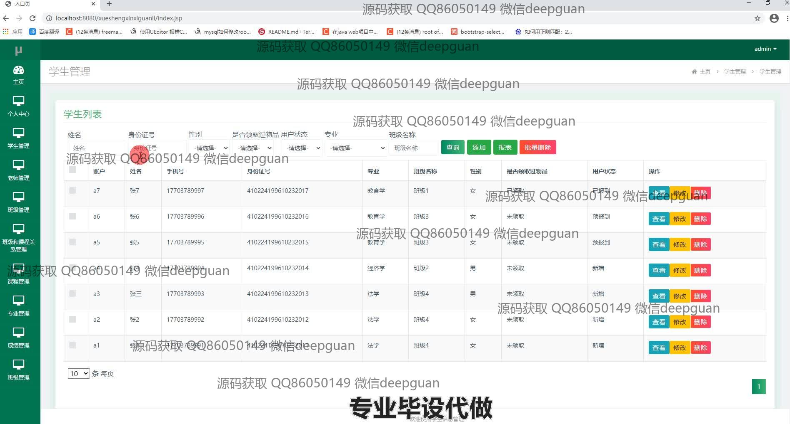
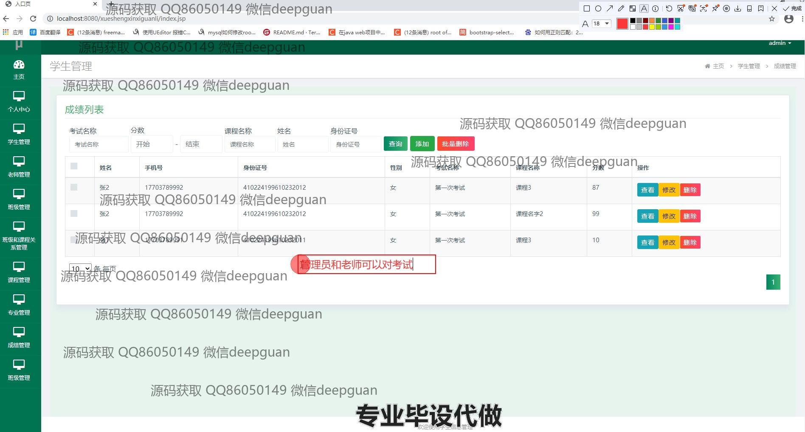
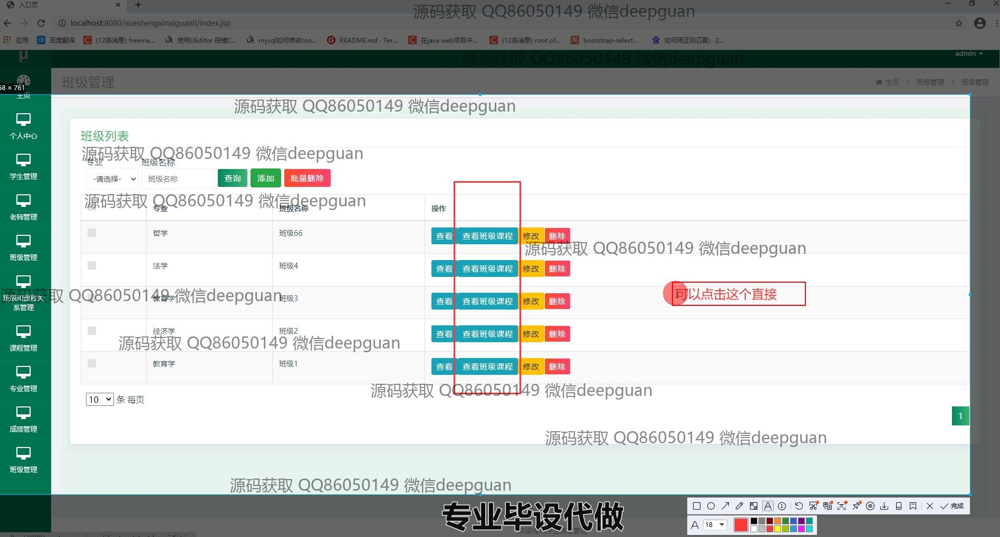
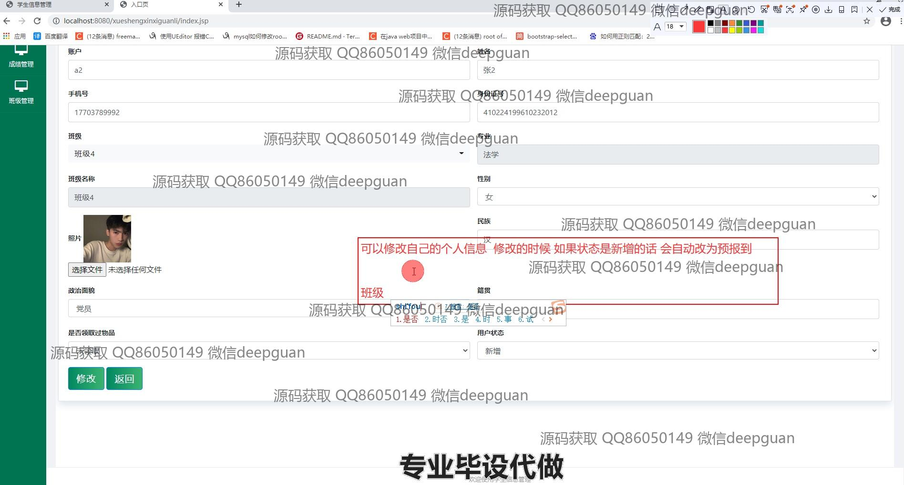

<h1 align="center">学生信息管理系统</h1>

## 简介
学生信息管理系统：角色分为管理员、用户；支持学生信息管理、班级管理、课程管理、成绩查看和统计分析等功能，提供数据增删改查、上传照片、权限管理及数据导出等操作。    --计算机毕业设计源码；毕设源码；java毕业设计源码

## 联系方式

<h3 align="center">获取完整代码与数据库文件 + 微信：deepguan QQ: 86050149 QQ群: 783742310</h3>

<h3 align="center">可帮忙远程部署 包运行成功！提供远程部署、修改代码、设计文档指导、代码讲解等服务！</h3>

## 功能介绍（完整见运行截图）
管理员：基本功能包括登录、注册及退出。管理员可通过主页导航栏访问学生管理、教师管理、班级管理、课程管理等模块。学生管理功能涵盖学生信息的增删改查，并支持批量删除和查询功能。课程管理提供课程的增删修改及课程教师关联管理。班级管理可以按专业查询班级，并查看班级课程设置。用户管理模块则包括查看用户状态和详细信息的权限。系统支持报表统计功能，帮助管理员对学生注册情况进行数据分析。

教师：教师用户具有访问个人中心的权限，可以查看与更新个人信息。系统允许教师录入并管理自己的课程信息，包括课程名称、内容及负责班级等。教师可以查看学生信息并进行必要的修正，如成绩录入、修改及删除。在管理学生成绩时，教师可以通过考试名称、课程名称、分数等信息进行查询与管理，帮助教师快速处理成绩事务。

学生：学生用户能通过个人中心查看并更新个人信息，包括姓名、身份证号、手机号及所属班级等基础资料。系统提供课程查询功能，允许学生查看已选课程的详细信息以及负责教师的联系方式。学生可以通过学院门户上传个人照片并选择政治面貌和物品领取状态。为了方便管理，系统还设置了用户查询功能，让学生在校期间可以独立查询和浏览个人或班级的相关信息。

数据库管理员：数据库管理主要通过Navicat Premium软件来实施，能够对学生信息管理系统的数据库进行结构管理。支持数据检索、插入、修改和删除操作等。管理员可使用SQL编辑器进行复杂查询，并通过导入导出功能实现数据迁移和备份。实现学生个人信息及相关教育数据的安全与维护，确保整个系统数据一致性与稳定性。

## 运行截图

本代码来源于网络,仅供学习参考使用!

